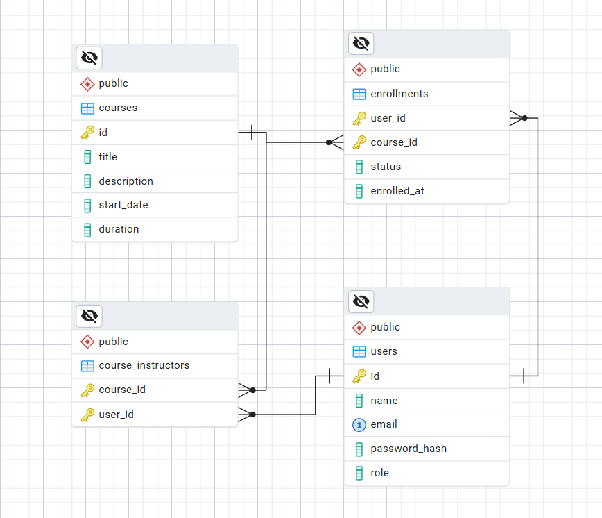

[English](#course-platform-backend-challenge)

# Kurs Platformu Backend Challenge

## İçindekiler
- [Genel Bakış](#genel-bakis)
- [Teknolojiler](#teknolojiler)
- [Dosya Yapısı](#dosya-yapisi)
- [Veritabanı Şeması](#veritabani-semasi)
- [Hızlı Kurulum](#hizli-kurulum)

<h2 id="genel-bakis">Genel Bakış</h2>

Bu platform, herkesin kolayca çevrimiçi eğitim almasını ve vermesini sağlayan modern bir eğitim uygulamasıdır. Öğrenciler ilgi alanlarına uygun kurslara erişebilir, öğrenme süreçlerini takip edebilir ve deneyimlerini paylaşabilir. Eğitmenler ise kendi içeriklerini oluşturup geniş bir kitleye ulaştırabilir. Kullanıcı dostu arayüzü, etkileşimli ders deneyimi ve ölçeklenebilir yapısıyla platform, hem öğrenenler hem öğretenler için esnek ve etkili bir eğitim ortamı sunar.

<h2 id="teknolojiler">Teknolojiler</h2>

- Veritabanı: PostgreSQL

<h2 id="dosya-yapisi">Dosya Yapısı</h2>

- db/       # Veritabanı İşlemleri: Tablolar, test verileri ve ERD.

<h2 id="veritabani-semasi">Veritabanı Şeması</h2>

ERD görselini ayrıca db/erd.png içinde de bulabilirsiniz.

<h2 id="hizli-kurulum">Hızlı Kurulum</h2>

Yakında...

---

# Course Platform Backend Challenge

## Table of Contents
- [Overview](#overview)
- [Technologies](#technologies)
- [File Structure](#file-structure)
- [Database Schema](#database-schema)
- [Quick Setup](#quick-setup)

## Overview
This platform is a modern educational application that allows anyone to easily take and provide online learning. Students can access courses suited to their interests, track their learning progress, and share their experiences. Instructors can create their own content and reach a wide audience. With its user-friendly interface, interactive lesson experience, and scalable structure, the platform offers a flexible and effective learning environment for both learners and educators.

## Technologies
- Database: PostgreSQL

## File Structure
- db/       # Database Operations: Tables, test data, and ERD.

## Database Schema

You can also find the ERD image in `db/erd.png`.

## Quick Setup
Coming soon...